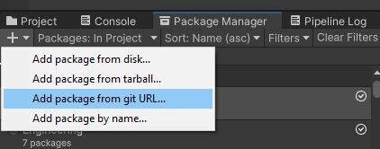
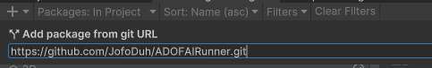
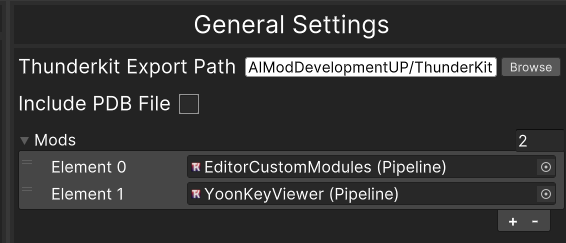

# ADOFAI Runner
Unity Editor extension for ADOFAI mod developers working alongside Thunderkit.
**Make sure to read the instructions to properly use this package!**
***
## Features
* **Symbol Definer** - Help define build symbol for different compiled build. Use to quickly switch between build to compile for different mod managers.
    - Currently supported mod managers: BepInEx & UnityModManager.
* **Run** - Choose the corresponding mod added in the settings and click run -> 
    - Compile everything by executing ThunderKit's pipeline.
    - Move all the needed file to a mod folder named based off of the pipeline's manifest identity name.
    - Execute the game automatically.
* **FRun** - Quickly launch the executable based off of the chosen build.
***
## Setup
1. Have a Unity Editor modding environment with ThunderKit
    - Make sure you have a Unity Editor modding environment with ThunderKit first before proceeding
    - You can follow this guide to set it up: TBA
2. Install ADOFAI Runner
    - ## Package Manager
        - Head over to the package manager in your Unity Project. Hit the plus top left of the panel, and click "Add package from git URL". 
        - Then paste `https://github.com/JofoDuh/ADOFAIRunner.git` into the field and click add afterwards. 
3. Configurations
    - Once the package finish importing. Set up ADOFAI Runner's settings by clicking on the setting icon on the toolbar, that should appear top left after the package finish importing: 
***
- ## Setting up ADOFAI Runner's settings
    - ## General
        - ThunderKit Export Path: The folder that ThunderKit compiles by default to. The folder should have some folders already inside depending on what you've done. "Libraries" folder should exist if you've compiled your mod assembly before and the "AssetBundleStaging" should exist if you've compiled assets bundle with ThunderKit before. Once you've pinpointed the folder, input the path to this field.
        - Include PDB File: Just includes the PDB file when moving for debugging purposes.
        - Mod List: Here you can add all the ThunderKit pipeline for all the mods you are currently developing in the Unity Project modding environment.
        ### Example: 
    - ## UMM & BepInEx
        - Mod Path: Just the folder within your game directory of the corresponding mod loader, that holds all the different mod folders.
        - Game Executable: The ADOFAI executable path of the corresponding mod loader.